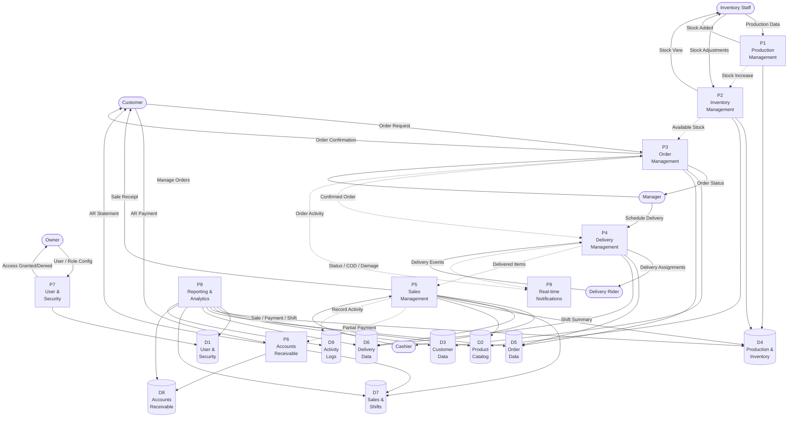
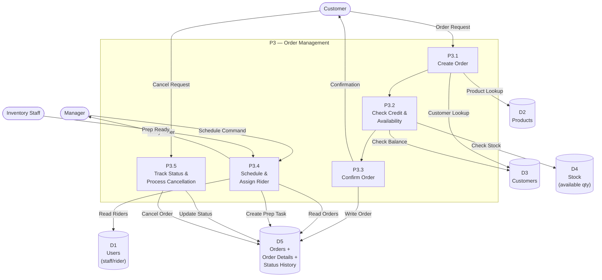
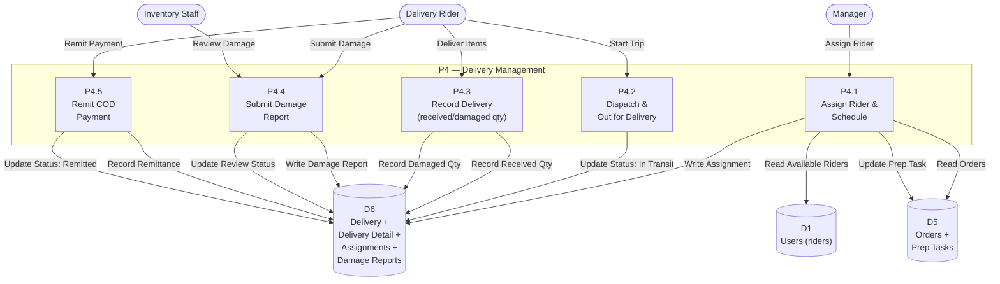
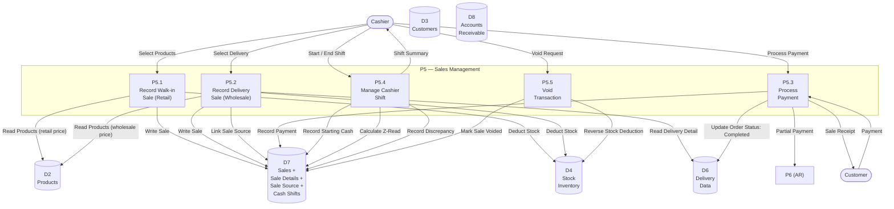
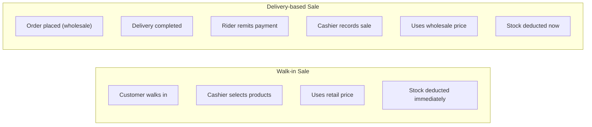
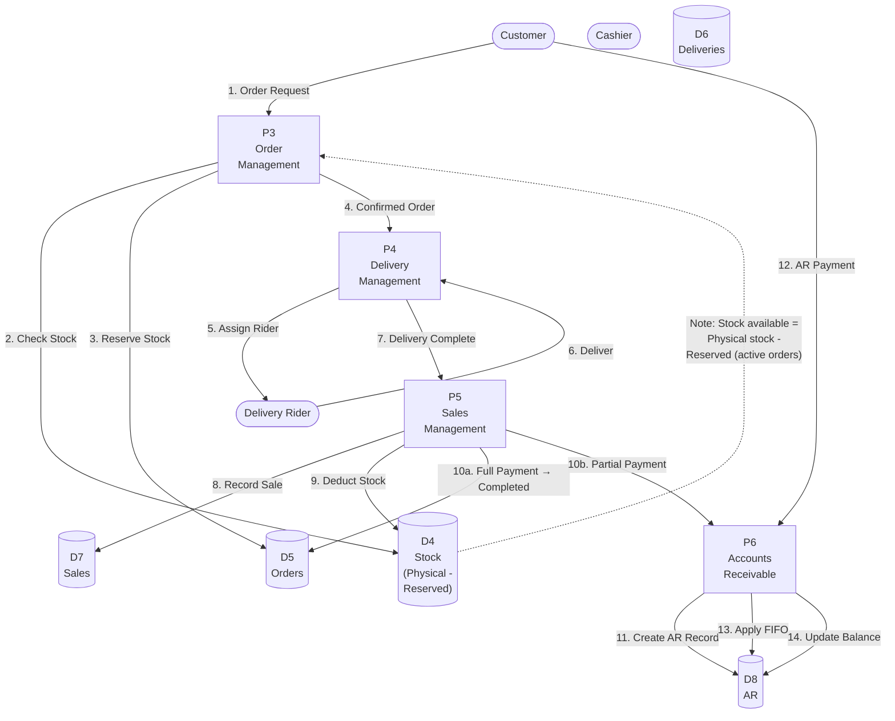
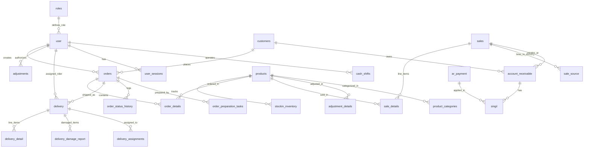

# VIP System — Data Flow Diagrams (DFD)

**System:** Villanueva Ice Plant Management System  
**Database:** `vip_db`  
**Platform:** PHP + MySQL + WebSocket  
**Location:** `C:\laragon\www\VIP-system\capstone`

---

## 1. Context Diagram (Level 0)

The system is viewed as a single process. External entities interact with it via data flows.

```mermaid
flowchart TD
    CUSTOMER([Customer])
    OWNER([Owner])
    MANAGER([Manager])
    CASHIER([Cashier])
    INV_STAFF([Inventory Staff])
    RIDER([Delivery Rider])

    SYS["VIP SYSTEM\n(Villanueva Ice Plant\nManagement System)"]

    CUSTOMER -->|"Order Request"| SYS
    CUSTOMER -->|"Payment (COD / Cash)"| SYS
    CUSTOMER -->|"AR Payment"| SYS
    SYS -->|"Order Confirmation"| CUSTOMER
    SYS -->|"Delivery of Products"| CUSTOMER
    SYS -->|"Invoice / AR Statement"| CUSTOMER

    OWNER -->|"User & Role Management"| SYS
    OWNER -->|"Module Access Config"| SYS
    OWNER -->|"System Settings"| SYS
    SYS -->|"Dashboard & Reports"| OWNER
    SYS -->|"Activity & Session Logs"| OWNER

    MANAGER -->|"Order Management"| SYS
    MANAGER -->|"Delivery Scheduling"| SYS
    MANAGER -->|"Report Requests"| SYS
    SYS -->|"Order & Delivery Status"| MANAGER
    SYS -->|"Analytics & Forecasts"| MANAGER

    CASHIER -->|"Sale Record (POS)"| SYS
    CASHIER -->|"Payment Processing"| SYS
    CASHIER -->|"Shift Start / End"| SYS
    SYS -->|"Product Prices & Stock"| CASHIER
    SYS -->|"Customer Information"| CASHIER
    SYS -->|"Z-Read / X-Read Reports"| CASHIER

    INV_STAFF -->|"Production Records"| SYS
    INV_STAFF -->|"Manual Stock Adjustments"| SYS
    INV_STAFF -->|"Prep Task Updates"| SYS
    INV_STAFF -->|"Damage Review"| SYS
    SYS -->|"Stock Levels & Limits"| INV_STAFF
    SYS -->|"Preparation Queue"| INV_STAFF
    SYS -->|"Stock Ledger"| INV_STAFF

    RIDER -->|"Delivery Status Update"| SYS
    RIDER -->|"COD Collection"| SYS
    RIDER -->|"Damage Report"| SYS
    RIDER -->|"Availability Change"| SYS
    SYS -->|"Delivery Assignments"| RIDER
    SYS -->|"Customer & Route Info"| RIDER
    SYS -->|"Collections Summary"| RIDER
```



---

## 2. Level 1 DFD

The system is decomposed into 9 major processes. Data stores represent logical groupings of database tables.

### Process Summary

| Process | Name | Description |
|---------|------|-------------|
| P1 | Production Management | Record ice production batches |
| P2 | Inventory Management | Track stock, adjustments, availability |
| P3 | Order Management | Create, confirm, schedule customer orders |
| P4 | Delivery Management | Assign riders, dispatch, record delivery |
| P5 | Sales Management | Record sales (walk-in & delivery), manage shifts |
| P6 | Accounts Receivable | Manage outstanding balances, FIFO payments |
| P7 | User & Security | Authentication, roles, module access, sessions |
| P8 | Reporting & Analytics | Dashboards, forecasts, exports |
| P9 | Real-time Notifications | WebSocket events for UI updates |

### Data Store Summary

| Store | Tables | Description |
|-------|--------|-------------|
| D1 | user, roles, user_module_access, user_sessions, manager_pins | User & security |
| D2 | products, product_categories, units | Product catalog |
| D3 | customers | Customer master |
| D4 | productions, stockin_inventory, adjustments, adjustment_details | Production & inventory |
| D5 | orders, order_details, order_status_history, order_preparation_tasks | Orders & prep |
| D6 | delivery, delivery_detail, delivery_assignments, delivery_damage_report, damage_types | Delivery & damage |
| D7 | sales, sale_details, sale_source, cash_shifts, shift_activity_log, shift_reviews, cash_shift_movements, cash_session_entries | Sales & shifts |
| D8 | account_receivable, ar_payment, singil, ar_retry_attempt | Accounts receivable |
| D9 | activity_logs | Audit trail |



---

## 3. Level 2 DFDs — Process Decompositions

### 3.1 P3 — Order Management

**Functions:** Create order, check credit, confirm, schedule, track status.

```
Order Status Lifecycle:
Requested → Confirmed → Scheduled for Delivery → Out for Delivery → Delivered → Completed
```



**Data flows in P3:**

| Flow | From | To | Data |
|------|------|----|------|
| Customer Lookup | P3.1 | D3 | customer_id, name, phone, address, credit_limit |
| Product Lookup | P3.1 | D2 | product_id, name, wholesale_price, retail_price |
| Check Balance | P3.2 | D3 | outstanding_balance, credit_limit_remaining |
| Check Stock | P3.2 | D4 | product_id, available_quantity |
| Write Order | P3.3 | D5 | order_id, customer_id, products, quantities, prices, status |

---

### 3.2 P4 — Delivery Management

**Functions:** Assign rider, dispatch, record delivery outcomes, damage reporting.

```
Delivery Status Lifecycle:
Scheduled → In Transit → Delivered / Returning → Remitted → Completed
```



**Data flows in P4:**

| Flow | From | To | Data |
|------|------|----|------|
| Read Orders | P4.1 | D5 | order_id, delivery_address, items, quantities |
| Write Assignment | P4.1 | D6 | assignment_id, order_id, rider_id, vehicle, schedule_date |
| Record Received Qty | P4.3 | D6 | delivery_detail_id, received_qty |
| Record Damaged Qty | P4.3 | D6 | delivery_detail_id, damage_qty, remarks |
| Write Damage Report | P4.4 | D6 | report_id, delivery_id, item_id, damaged_qty, reason, photo |

---

### 3.3 P5 — Sales Management

**Functions:** Record walk-in sale, record delivery-based sale, process payment, manage cashier shifts.



**Sales vs Delivery relationship:**



---

### 3.4 Full Order-to-Payment Pipeline (P3 → P4 → P5 → P6)

This shows the end-to-end flow from order creation through to payment and AR.



**Step-by-step data flow:**

| Step | Process | Action | Data Impact |
|------|---------|--------|-------------|
| 1 | P3 | Customer requests order | Order created (status: Requested) |
| 2 | P3 | Check available stock | Read D4 (physical - reserved) |
| 3 | P3 | Reserve quantities | Write D5 (order_details with qty) |
| 4 | P3 | Confirm & schedule | Write D5 (status: Scheduled), D6 |
| 5 | P4 | Assign delivery rider | Write D6 (assignment) |
| 6 | RID | Rider delivers | Update D6 (status: In Transit → Delivered) |
| 7 | P4 | Delivery complete | Update D6 (received_qty, damage_qty) |
| 8 | P5 | Cashier records sale | Write D7 (sale record) |
| 9 | P5 | Deduct inventory | Update D4 (decrease quantity) |
| 10a | P5 | Full payment → completed | Update D5 (status: Completed) |
| 10b | P5 | Partial payment | Trigger P6 |
| 11 | P6 | Create AR record | Write D8 (amount_due, due_date) |
| 12 | CUST | Customer pays AR | Payment to P6 |
| 13 | P6 | Apply FIFO | Oldest AR paid first via D8 |
| 14 | P6 | Update balance | Write D8 (remaining_balance) |

---

## 4. Entity Relationship Summary



---

## 5. Key Business Rules (for DFD annotations)

| Rule | Description |
|------|-------------|
| R1 | Inventory is NOT deducted at order creation — only when sale is recorded (payment received) |
| R2 | Available Stock = Physical Stock (D4) — Reserved Stock (active orders in D5) |
| R3 | Outstanding customer balance (D3) blocks new orders |
| R4 | Walk-in sales use retail price; delivery-based sales use wholesale price |
| R5 | AR payments applied FIFO (oldest invoice paid first) |
| R6 | Damage reports (by rider) must be reviewed & approved before stock adjustment |
| R7 | Each delivery creates a separate AR record |
| R8 | Real-time events published via WebSocket on order.scheduled and delivery.ready |

---

## 6. Glossary

| Term | Definition |
|------|------------|
| COD | Cash on Delivery — payment collected by rider at delivery |
| POS | Point of Sale — cashier transaction terminal |
| AR | Accounts Receivable — outstanding customer credit |
| FIFO | First In, First Out — payment applied to oldest AR invoice |
| Z-Read | End-of-shift report summarizing cashier sales and discrepancies |
| Prep Task | Inventory staff task to prepare an order for loading |
| Singil | Junction table linking AR records to payment records |
| DFD | Data Flow Diagram — graphical representation of data movement |
